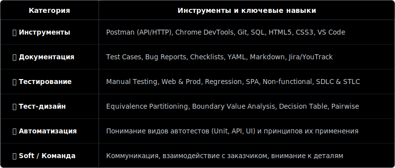

  

 

   

  

  
  

$\color{#A855F7}{\Large\textsf{Обо мне}}$

 

 Я начинающий QA-инженер с бэкграундом в строительной сфере, где отвечал за контроль качества и сдачу объектов в срок. Умею читать техническую документацию, находить несоответствия и координировать работу команды. Этот
 опыт работы научил меня главному: любая ошибка в документации или реализации стоит дорого, поэтому внимание к деталям и соблюдение регламентов — мои главные принципы.

* 🌍  Живу в Москве
* ✉️  Связь со мной gw.vitalik@yandex.ru
* 🚀  Сейчас работаю над этим <a href="https://github.com/AtarixQA/qa-engineer-project-85">проектом</a> 
* 🧠  Изучаю Python для автоматизации тестирования
* 👥  Ищу стажировку или работу на junior позицию

  

$\color{#A855F7}{\Large\textsf{Мой стек технологий}}$

  

$\color{#A855F7}{\Large\textsf{Моя статистика}}$

  
  
  

